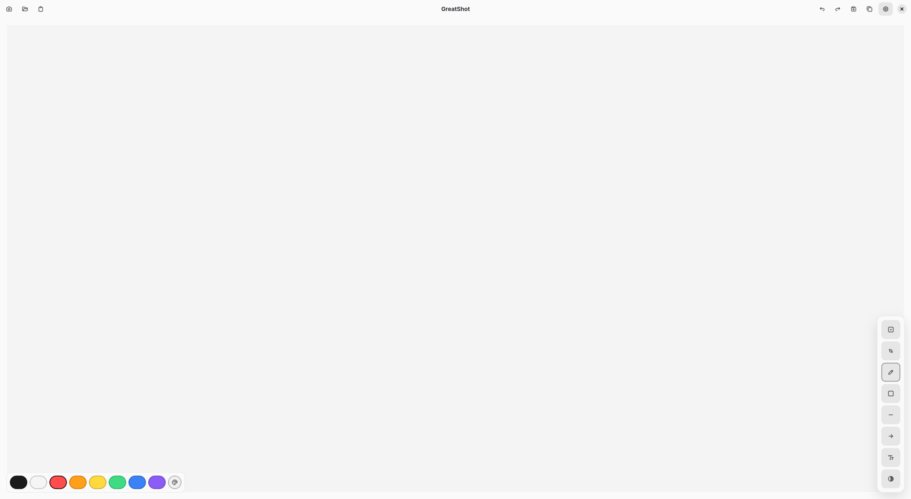

# GreatShot

Minimal, fast screenshot + annotation tool for Linux.

Motivation: Flameshot isn’t reliable on GNOME Wayland, so GreatShot focuses on a clean, portal-based workflow that works on modern Fedora/GNOME setups.

## Screenshots



## Build (host)
Fedora dependencies:
```
sudo dnf install rust cargo gtk4-devel libadwaita-devel pkgconf-pkg-config gcc
```

Build and run:
```
cargo run
```

## Desktop entry (optional)
Install the binary somewhere on your PATH and then install the desktop file + icon:
```
cargo build --release
install -Dm755 target/release/greatshot ~/.local/bin/greatshot
install -Dm644 data/io.github.syed.greatshot.desktop ~/.local/share/applications/io.github.syed.greatshot.desktop
install -Dm644 data/icons/hicolor/scalable/apps/io.github.syed.greatshot.svg ~/.local/share/icons/hicolor/scalable/apps/io.github.syed.greatshot.svg
```

If you installed the binary in a different path, edit the `Exec=` line in `~/.local/share/applications/io.github.syed.greatshot.desktop`.

Alternatively:
```
make install
```
